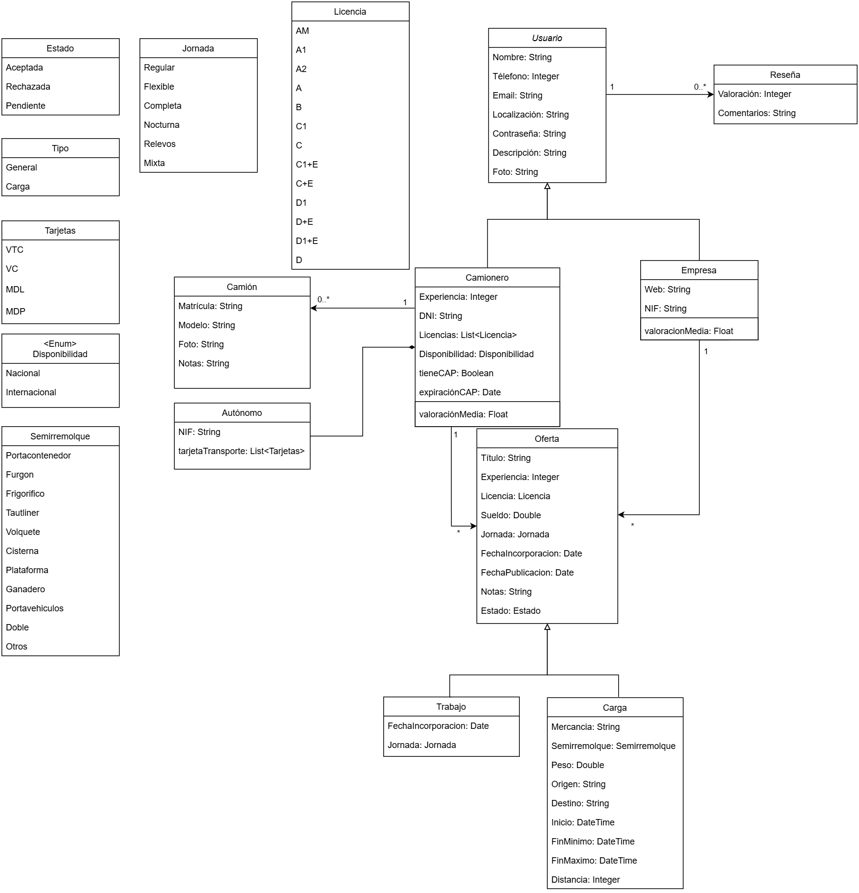

<h1 align="center">
  Camyo
</h1>

  

<h3 align="center">
  <strong>Grupo 5</strong>
</h3>

<h1 align="center">
  <strong>Diagrama de Clases</strong>
</h1>

  <strong>Nombre del Entregable:</strong> Sprint 1

  <strong>Asignatura:</strong> Ingeniería del Software y Práctica Profesional  

  <strong>Curso:</strong> 2024-2025  

### Contribuciones del Equipo

| Nombre(s) y Apellido(s)       | Tipo de Contribución          |
|-------------------------------|-------------------------------|
| Adriana Vento Conesa          | Elaboración del Documento     |

## Tabla de Contenidos

1. [Diagrama de Clases](#diagrama-de-clases)

## Diagrama de Clases

A continuación, se presenta el diagrama de clases preliminar de la aplicación, el cual constituye una visión inicial del diseño estructural del sistema. Este diagrama ha sido creado colaborativamente entre distintos miembros del equipo de backend, a partir de los mocks de la aplicación. Es importante destacar que este diagrama está sujeto a cambios y revisiones a medida que el proyecto avanza, adaptándose a nuevos requisitos, restricciones o mejoras identificadas durante el desarrollo.

