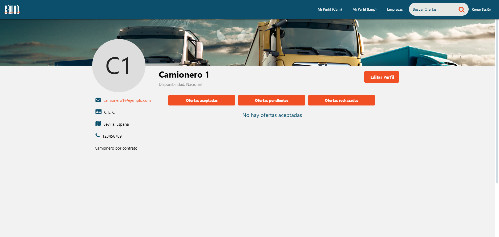
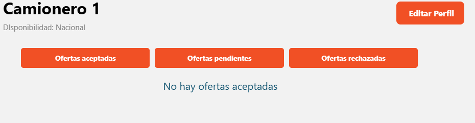
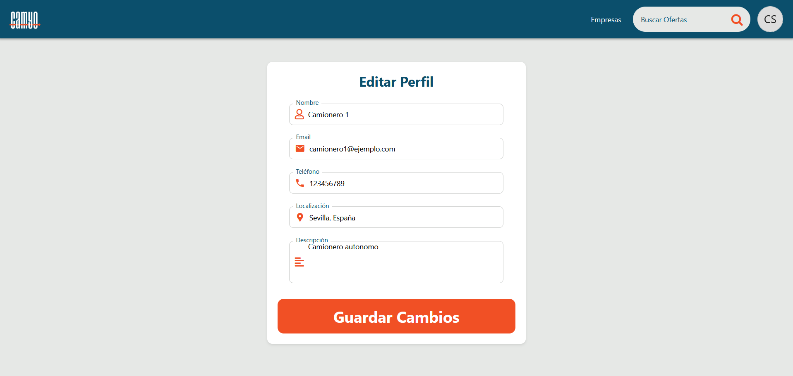

<h1 align="center">
  Camyo
</h1>

  

<h3 align="center">
  <strong>Grupo 5</strong>
</h3>

<h1 align="center">
  <strong>Revisión</strong>
</h1>

  <strong>Nombre del Entregable:</strong> Sprint 1 

  <strong>Asignatura:</strong> Ingeniería del Software y Práctica Profesional  

  <strong>Curso:</strong> 2024-2025  

# Contribuciones del Equipo

| Nombre(s) y Apellido(s) | Tipo de Contribución |
| --- | --- |
| Lucía Pérez Gutiérrez | Redacción Inicial y Listado de Ofertas |
| Claudia Meana Iturri | Redacción de Detalles de Oferta y Registro de Transportistas y Empresas, Capturas Edición/Creación de ofertas |
| José Ramón Baños Botón | Redacción Perfil de Empresa y Listado de Empresas |
| Sonia María Rus Morales | Texto de Edición/Creación de ofertas|
| Raúl Heras Pérez | Redacción y capturas de perfil de transportista |

# Tabla de Contenidos

1. [Resumen Ejecutivo](https://www.notion.so/Gu-a-de-uso-de-la-aplicaci-n-1b092cecbe9980f5a4b6d7897ce99f44?pvs=21)
2. [Datos para la Revisión](https://www.notion.so/Gu-a-de-uso-de-la-aplicaci-n-1b092cecbe9980f5a4b6d7897ce99f44?pvs=21)
3. [Autentificación](https://www.notion.so/Gu-a-de-uso-de-la-aplicaci-n-1b092cecbe9980f5a4b6d7897ce99f44?pvs=21)
    - [LogIn](https://www.notion.so/Gu-a-de-uso-de-la-aplicaci-n-1b092cecbe9980f5a4b6d7897ce99f44?pvs=21)
    - [Registro](https://www.notion.so/Gu-a-de-uso-de-la-aplicaci-n-1b092cecbe9980f5a4b6d7897ce99f44?pvs=21)
4. [Ofertas](https://www.notion.so/Gu-a-de-uso-de-la-aplicaci-n-1b092cecbe9980f5a4b6d7897ce99f44?pvs=21)
5. [Camioneros](https://www.notion.so/Gu-a-de-uso-de-la-aplicaci-n-1b092cecbe9980f5a4b6d7897ce99f44?pvs=21)
6. [Empresas](https://www.notion.so/Gu-a-de-uso-de-la-aplicaci-n-1b092cecbe9980f5a4b6d7897ce99f44?pvs=21)

## 1. Resumen Ejecutivo

Este documento proporciona una guía detallada para revisar la aplicación web de *matchmaking* de camioneros. Incluye un mapeo explícito de los casos de uso (UC) a las interacciones en el software, datos necesarios para la revisión, requisitos del sistema y un enlace a la demostración.

## 2. Herramienta de Seguimiento

## 3. Datos para la Revisión

En esta tabla aparece toda la información necesaria para la revisión de Camyo.

| Información | Detalles |
| --- | --- |
| Url de la Organización de Github | https://github.com/Camyo-ISPP |
| Url del repositorio de Github | https://github.com/Camyo-ISPP/CamyoApp |
| Url del repositorio de Documentación | https://github.com/Camyo-ISPP/Documentacion y en la carpeta docs del repo de la Aplicación |
| Url de la Landing Page | https://sites.google.com/view/camyo-landing-page/ |
| Url del despliegue Frontend | https://ispp-2425-g5.web.app/ |
| Url de la herramienta de seguimiento  | https://app.clockify.me/login |
| Credenciales para la herramienta de seguimiento  | Email: [profesores.camyo@gmail.com](mailto:profesores.camyo@gmail.com) Contraseña de la cuenta de google: Profesores.camyo!01 |
| Requisitos potenciales para usar el sistema | Ninguno |
| Url de la demo |  |
| Usuario de Empresa (Camyo) | **Usuario:** emp_etsii1  **Contraseña:** etsiipass **Usuario:** emp_etsii2  **Contraseña:** etsiipass |
| Usuario de Camionero(Camyo) | **Usuario:** cam_etsii1  **Contraseña:** etsiipass **Usuario:** cam_etsii2  **Contraseña:** etsiipass (Autónomo) |
| Usuario Administrador  | **Usuario:** admin  **Contraseña:** etsiipass |
## 4. Ofertas

### 4.1 Pantalla principal de Ofertas

Al acceder a la URL de despliegue, lo primero que verás será la página principal de ofertas para camioneros, la cual está disponible para todos los usuarios sin necesidad de registro. Desde esta pantalla, podrás explorar las ofertas disponibles y acceder a los detalles de cada una de ellas.

### 4.2 Detalles de Oferta

Al entrar en ver detalles desde la pantalla de ofertas principal, que está disponible sin iniciar sesión. Para aplicar a una oferta necesitará iniciar sesión, para ello el botón te redirige a la pantalla de inicio de sesión. 

Una vez iniciado sesión como transportista, verá el botón de poder aplicar a una oferta.

Si le diera a aplicar a una oferta, le saldrá esta notificación que se iría tras 2,5 segundos.

Y ahora en la pantalla saldría:

Que si lo deseara podría cancelar la solicitud y volvería a aparecer la opción de aplicar a una oferta.

Si estuviera iniciado sesión como empresa y no fuera su oferta, la pantalla saldría de la siguiente manera:

Si fuera la oferta de la empresa, entonces saldría un botón para editar la oferta:

### 4.3 Editar oferta
Una vez que la empresa ha accedido a los detalles de alguna de sus ofertas, podrá actualizar los datos si lo desea con el botón “Editar oferta”. Desde la pantalla de edición de oferta se podrá o bien eliminar o, una vez realizados los cambios deseados, actualizar la oferta con los nuevos datos.

### 4.4 Crear oferta
Una vez iniciada sesión como empresa, puede ver su perfil. Aquí tiene la opción de publicar una oferta nueva. Para hacerlo, hay que rellenar los campos requeridos según el tipo de oferta que se quiera publicar, ya sea de carga o de trabajo. Tras publicarla, esta oferta será visible para el resto de usuarios.

## 5. Autentificación

### 5.1 LogIn

Para acceder al login se podrá hacer de varias maneras.

La primera desde la barra de navegación, en ella se encuentra un botón de inicial sesión que nos llevará hacía la pantalla de login. Donde se podrá inicial sesión con los usuariosproporcionados

### 5.2 Registro

Cuando se va a la pantalla de iniciar sesión desde la barra de navegación, si no hay sesión iniciada al haacer clic sobre inicio de sesión. 

Cuando se hace clic sobre regístrate, le llevará a la siguiente pantalla, donde podrá elegir si hacer perfil de transportista o de empresa.

Explicación más detallada de cada perfil en los puntos: 6.1 y 7.1

## 6. Transportista

### 6.1 Crear perfil de Transportista
De la pantalla de registro, al seleccionar en camionero (del punto 5.2), podrá rellenar todos los datos para finalmente registrarse con el botón de regístrate.

Si selecciona sobre seleccionar foto, le abrirá la carpeta de archivos para seleccionar una foto:

Una vez elegida la foto, puede decidir si cambiarla o borrarla

Y de aquí puede seguir rellenando el resto de campos para registrarse correctamente como transportista.

Si no se hace correctamente el siguiente mensaje aparecerá:

### 6.2 Perfil de Transportista

Una vez registrado e iniciado sesión, el camionero puede acceder a su perfil.

Desde esta pantalla podrá revisar sus datos, acceder a la edición de perfil y ver las ofertas acepptadas, pendientes y rechazadas.

En la pantalla de edición de perfil se podrán cambiar distintos datos del usuario y guardar los cambios.

## 7. Empresas

### 7.1 Crear de Perfil de Empresa
De la pantalla de registro, al seleccionar en camionero (del punto 5.2), podrá rellenar todos los datos para finalmente registrarse con el botón de regístrate.

Si selecciona sobre seleccionar foto, le abrirá la carpeta de archivos para seleccionar una foto:

Una vez elegida la foto, puede decidir si cambiarla o borrarla

Y de aquí puede seguir rellenando el resto de campos para registrarse correctamente como empresa.

Si no se hace correctamente el siguiente mensaje aparecerá:

### 7.2 Perfil de Empresa

La página de perfil de empresa permite a los usuarios registrados como empresa visualizar y gestionar la información de su empresa dentro de la aplicación. Desde esta pantalla, se pueden actualizar los datos en el botón “Editar Perfil”, visualizar el estado de las “Ofertas aceptadas”, “Ofertas pendientes” y “Ofertas rechazadas” y crear y publicar ofertas en el botón “Publicar nueva oferta”.

### 7.2 Listado de Empresas

Esta pantalla muestra un listado de las empresas que hay en la aplicación, proporcionando información clave sobre cada una de ellas.

