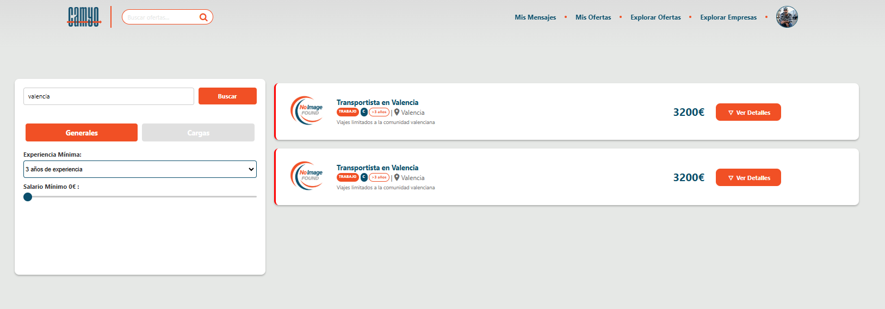
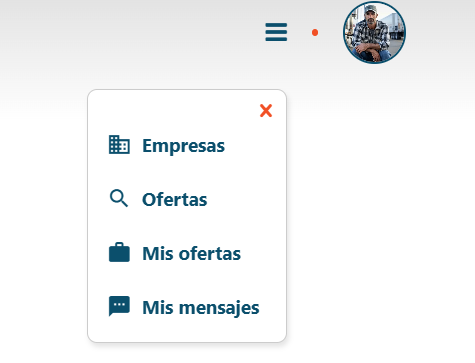
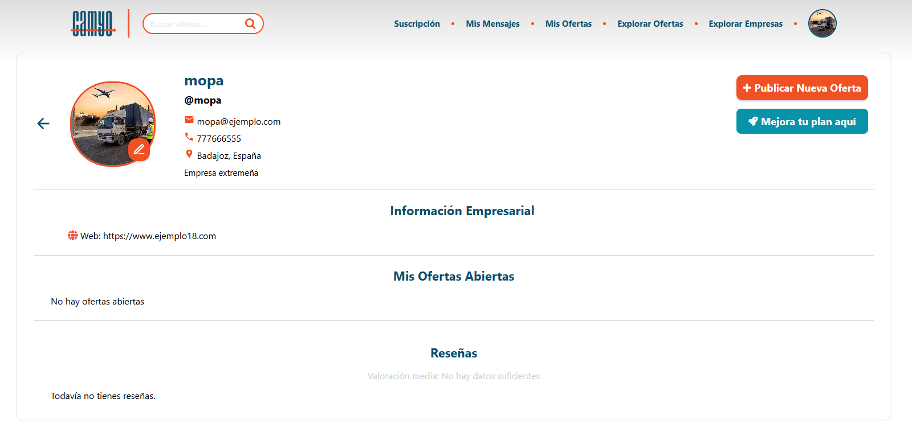
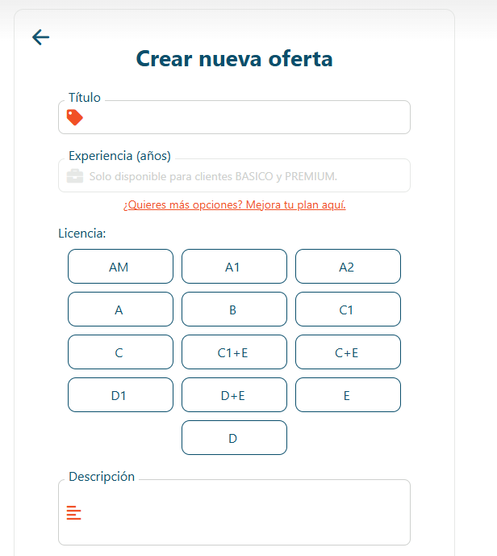

<h1 align="center">
  Camyo
</h1>

  

<h3 align="center">
  <strong>Grupo 5</strong>
</h3>

<h1 align="center">
  <strong>Revisión</strong>
</h1>

  <strong>Nombre del Entregable:</strong> Sprint 2

  <strong>Asignatura:</strong> Ingeniería del Software y Práctica Profesional  

  <strong>Curso:</strong> 2024-2025  

# Contribuciones del Equipo

| Nombre(s) y Apellido(s) | Tipo de Contribución |
| --- | --- |
| Adriana Vento Conesa | Redacción Comportamiento de Suscripciones |
| Isabel Cantero Corchero | Redacción de Autenticación, registro, inicio de sesión, General, inicio, explorar ofertas y empresas, detalle de oferta y empresa, Camionero (perfil, mis ofertas), Empresa (perfil, mis ofertas) |
| Lucía Pérez Gutiérrez  | Redacción de la funcionalidad de promocionar ofertas |
# Tabla de Contenidos

1. [Resumen Ejecutivo](#1-resumen-ejecutivo)
2. [Datos para la Revisión](#2-datos-para-la-revisión)
3. [Autenticación](#3-autenticación)  
   3.1 [Registro](#31-registro)  
   3.1.1 [Registro como camionero](#311-registro-como-camionero)  
   3.1.2 [Registro como empresa](#312-registro-como-empresa)  
   3.2 [Inicio de sesión](#32-inicio-de-sesión)  

4. [General](#4-general)  
   4.1 [Página de inicio](#41-página-de-inicio)  
   4.2 [Explorar y buscar ofertas](#42-explorar-y-buscar-ofertas)  
   4.3 [Detalle de oferta](#43-detalle-de-oferta)  
   4.4 [Listado de empresas](#44-listado-de-empresas)  
   4.5 [Detalle de empresa](#45-detalle-de-empresa)  

5. [Camionero](#5-camionero)  
   5.1 [Perfil de camionero](#51-perfil-de-camionero)  
   5.2 [Mis Ofertas](#52-mis-ofertas)  
   5.3 [Chat](#53-chat)  

6. [Empresas](#6-empresas)  
   6.1 [Perfil de empresa](#61-perfil-de-empresa)  
   6.2 [Crear Oferta](#62-crear-oferta)  
   6.3 [Suscripciones](#63-suscripciones)  
   6.4 [Promocionar Oferta](#64-promocionar-oferta)  
   6.5 [Chat](#65-chat)  
   6.6 [Mis Ofertas](#66-mis-ofertas)  

7. [Reseñas](#7-reseñas)  
   7.1 [Reseñas empresas](#71-reseñas-empresas)  
   7.2 [Reseñas camioneros](#72-reseñas-camioneros)  
   7.3 [Crear y editar reseñas](#73-crear-y-editar-reseñas)

## 1. Resumen Ejecutivo

Este documento proporciona una guía detallada para revisar la aplicación web de *matchmaking* de camioneros. Incluye un mapeo explícito de los casos de uso (UC) a las interacciones en el software, datos necesarios para la revisión, requisitos del sistema y un enlace a la demostración.

## 2. Datos para la Revisión

En esta tabla aparece toda la información necesaria para la revisión de Camyo.

| Información | Detalles |
| --- | --- |
| Url de la Organización de Github | https://github.com/Camyo-ISPP |
| Url del repositorio de Github | https://github.com/Camyo-ISPP/CamyoApp |
| Url del repositorio de Documentación | https://github.com/Camyo-ISPP/Documentacion |
| Url de la Landing Page | https://sites.google.com/view/camyo-landing-page/ |
| Url del despliegue Frontend | https://ispp-2425-g5-s2-fafe6.web.app/ |
| Url de la herramienta de seguimiento  | https://app.clockify.me/login |
| Credenciales para la herramienta de seguimiento  | Email: [profesores.camyo@gmail.com](mailto:profesores.camyo@gmail.com) Contraseña de la cuenta de google: Profesores.camyo!01   Para acceder, hagan login con este email y recibirán un correo al correo con el código para acceder. |
| Requisitos potenciales para usar el sistema | Ninguno. |
| Url de la demo | [Reemplazar!] |
| Usuario de Empresa (Camyo) | **Usuario:** emp_etsii1  **Contraseña:** etsiipass **Usuario:** emp_etsii2  **Contraseña:** etsiipass |
| Usuario de Camionero(Camyo) | **Usuario:** cam_etsii1  **Contraseña:** etsiipass **Usuario:** cam_etsii2  **Contraseña:** etsiipass (Autónomo) |
| Usuario Administrador  | **Usuario:** admin  **Contraseña:** etsiipass |

## 3. Autenticación

### 3.1 Registro
Pantalla inicial del registro donde el usuario debe elegir si se registrará como Camionero o Empresa.

#### 3.1.1 Registro como camionero
Formulario detallado para el registro de camioneros, donde se solicitan datos personales, licencias, experiencia, CAP, y condición de autónomo.

#### 3.1.2 Registro como empresa
Formulario de registro para empresas, incluyendo información básica, datos de contacto, sitio web y número de identificación fiscal. 

### 3.2 Inicio de sesión
Formulario para que usuarios registrados ingresen con su nombre de usuario y contraseña. Incluye opción para redirigirse al registro si aún no tienen cuenta.

## 4. General

### 4.1 Página de inicio
Visitante:

Pantalla principal para usuarios no autenticados, destacando el objetivo de la plataforma y mostrando ofertas recientes disponibles para explorar sin necesidad de iniciar sesión.

Usuario registrado:

Pantalla de bienvenida personalizada para usuarios registrados, con accesos rápidos al perfil y a vacantes, además de una lista de ofertas recientes divididas por tipo: carga y trabajo.

### 4.2 Explorar y buscar ofertas

Vista general del buscador de ofertas donde los usuarios pueden explorar las ofertas publicadas.

La pantalla tiene una seccion de búsqueda que permite filtrar ofertas según los requisitos del usuario, mostrando resultados relevantes en tiempo real.

### 4.3 Detalle de oferta
Vista del detalle de una oferta visible para visitantes, que muestra los datos pero requiere iniciar sesión para poder solicitarla.

Pantalla de detalle de una oferta para usuarios autenticados, con botón activo para solicitarla y toda la información relevante del transporte: presupuesto, licencias, origen/destino, fechas y carga.

Si solicitamos la oferta nos saldrá un mensaje si la solicitud se ha completado.

### 4.4 Listado de empresas
Pantalla que muestra un listado de empresas registradas en la plataforma con información básica como nombre, web, identificación, ubicación y teléfono, además de acceso a sus perfiles detallados.

### 4.5 Detalle de empresa
Vista del perfil de una empresa con su información de contacto, descripción, sitio web, ofertas activas y opción para contactar o dejar una reseña. También se muestra una sección para valoraciones de otros usuarios.

## 5. Camionero

### 5.1 Perfil de camionero

Vista privada del perfil del camionero, donde puede ver su información profesional y reseñas recibidas. Además puede editar los datos de su perfil haciendo click en el icono de lápiz de al lado de la foto de perfil.

Perfil público visible para las empresas, donde se muestra información laboral, contacto y reseñas recibidas.

### 5.2 Mis Ofertas

Una vez iniciada la sesión como camionero, aparece en la barra de navegación la sección "Mis Ofertas" que muestra las solicitudes que ha realizado el camionero y se pueden filtrar por ofertas pendientes (en espera de respuesta por parte de la empresa), asignadas (ofertas aceptadas por la empresa) o descartadas (ofertas en las que el camionero no fue seleccionado para el trabajo o carga).

### 5.3 Chat
Una vez iniciado sesión como transportista se podrá acceder a la pantalla de mensajería mediante la barra de navegación, en el apartado de "Mis Mensajes".

En la pantalla de chats se podrán ver los chats abiertos. Una vez que se seleccione el chat, se abrirá automáticamente a la derecha de la lista, por lo que se podrá comenzar a enviar y recibir mensajes.

## 6. Empresas

### 6.1 Perfil de empresa

Vista privada del perfil de empresa, con acceso para editar información, publicar nuevas ofertas y gestionar el plan de suscripción. Muestra también las ofertas activas y las reseñas recibidas.

Perfil público de empresa donde se pueden consultar los datos de contacto, descripción, web, ofertas abiertas y reseñas de la empresa.

### 6.2 Crear Oferta

Al acceder a la plataforma como empresa, podrás crear ofertas para camioneros desde tu perfil. Para hacerlo, debes rellenar los campos requeridos según el tipo de oferta que quieras publicar, ya sea de carga o de trabajo. Tras publicarla, esta oferta será visible para el resto de usuarios.

Sin embargo, el número de ofertas activas que puedes tener simultáneamente depende del nivel de tu suscripción actual:

- **Suscripción Gratis**: Puedes tener hasta **1 oferta activa**.
- **Suscripción Básica**: Puedes tener hasta **3 ofertas activas**.
- **Suscripción Premium**: No hay límite en el número de ofertas activas.

### 6.3 Suscripciones

En la pantalla de perfil de empresa, verás un botón para crear una nueva oferta. Este botón cambiará su estado según las siguientes condiciones:

- Si aún no has alcanzado el límite de ofertas permitidas por tu suscripción:
  - El botón estará habilitado y podrás crear una nueva oferta.

- Si has alcanzado el límite de ofertas activas permitidas:
  - El botón se bloqueará y mostrará el mensaje **"Límite de Ofertas Alcanzado"**.

Pantalla donde las empresas pueden elegir entre tres planes: Gratis, Básico y Premium, con distintas capacidades para publicar ofertas de empleo según el nivel de suscripción.

### 6.4 Promocionar Oferta

En el perfil de oferta se podrán ver las ofertas abiertas de las empresas, y en función del plan elegido se pondrá en disposición la posibilidad de promocionar una o varias ofertas. 

### 6.5 Chat
Una vez iniciado sesión como empresa se podrá acceder a la pantalla de mensajería mediante la barra de navegación, en el apartado de "Mis Mensajes".

En la pantalla de chats se podrán ver los chats abiertos. Una vez que se seleccione el chat, se abrirá automáticamente a la derecha de la lista, por lo que se podrá comenzar a enviar y recibir mensajes.

### 6.6 Mis Ofertas
Listado de ofertas de trabajo o carga creadas por la empresa que han sido asignadas (abiertas) o no (cerrradas) a algún camionero.

## 7. Reseñas
### 7.1 Reseñas empresas
Una vez registrado como empresa, en su perfil, podemos ver si dicha empresa tiene o no alguna reseña y su valoración media.

También pueden ver las reseñas de la empresa cualquier otro usuario.

### 7.2 Reseñas camioneros
Una vez registrado como camionero, en su perfil, podemos ver si dicho camionero tiene o no alguna reseña y su valoración media.

También pueden ver las reseñas del camionero cualquier otro usuario.

### 7.3 Crear y editar reseñas
Un usuario podrá crear una reseña pulsando en el botón "Escribir reseña".

Luego, el usuario pulsando el botón "Editar reseña" podra editar la reseña. 

