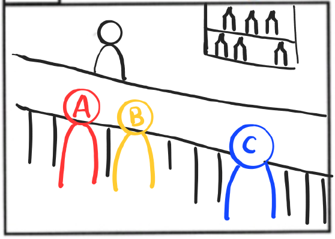
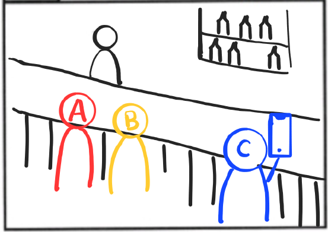
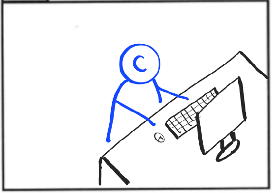
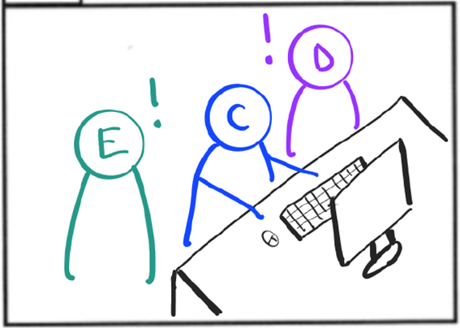
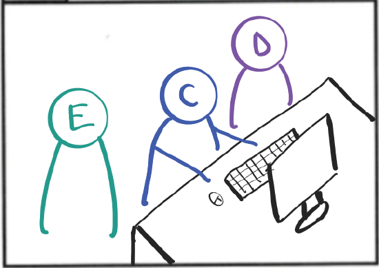
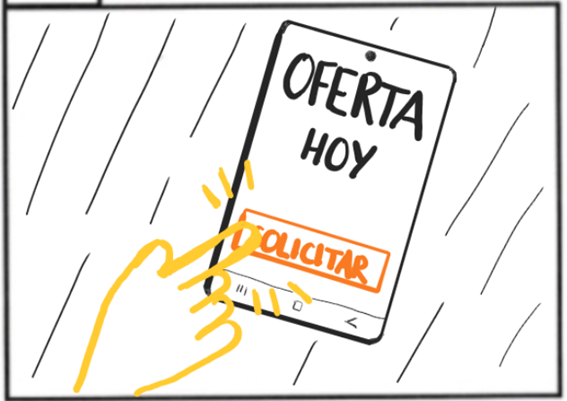
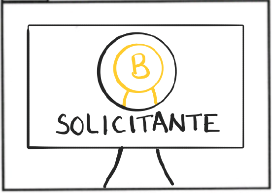
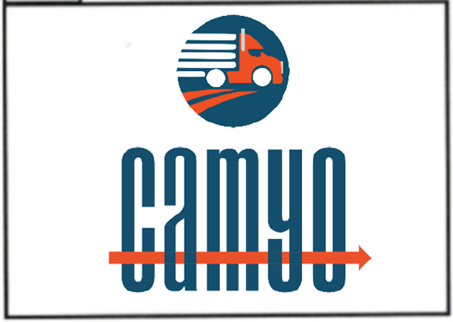

<h1 align="center">
  Camyo
</h1>

  

<h3 align="center">
  <strong>Grupo 5</strong>
</h3>

<h1 align="center">
  <strong>Storyboard</strong>
</h1>

  <strong>Nombre del Entregable:</strong> Sprint 2 

  <strong>Asignatura:</strong> Ingeniería del Software y Práctica Profesional  

  <strong>Curso:</strong> 2024-2025  

### Contribuciones del Equipo

| Nombre(s) y Apellido(s)       | Tipo de Contribución          |
|-------------------------------|-------------------------------|
| Sonia María Rus Morales       | Redacción del documento       |

## Tabla de Contenidos

1. [Introducción](#introducción)
2. [Storyboard para empresas](#storyboard-para-empresas)

## Introducción

Este documento presenta el Storyboard para la aplicación Camyo centrado en la visión para las empresas.

## Storyboard para empresas

**Objetivo:** Mostrar de forma visual y narrativa cómo la aplicación Camyo soluciona un problema real en el sector del transporte. Captar de manera clara cómo Camyo simplifica la contratación de camioneros, ofreciendo una solución práctica y moderna.

**Escena 1: Bar**

- **Acción:** Dos personas se encuentran en un bar:  

  B: “Ya he terminado por hoy, ¿y tú qué?” 

  A: “Desde que me descargué Camyo no paro, todo el día de un lado a otro.” 

- **Sonido:** Ruido ambiente, bar de carretera.  
- **Observaciones técnicas:** Persona C entra en escena, escucha la conversación mientras mira de reojo.

**Escena 2: Bar**

- **Acción:** Suena un teléfono, la persona atiende urgente la llamada.  

  C: “¿Cómo? ¿¡No hay nadie disponible!? ¡No puede ser!” 

- **Sonido:** Teléfono móvil.  
- **Observaciones técnicas:** Cambio de personaje principal a C.

**Escena 3: Oficina**

- **Acción:** La escena se traslada a la oficina. C busca en el ordenador: 

  C: “¿Qué es esto de Camyo? ¿Por eso no tengo camioneros?” 

- **Sonido:**  Teclado, sonido ambiente. 
- **Observaciones técnicas:** -

**Escena 4: Oficina**

- **Acción:** Dos compañeros se aproximan al hombre que se encuentra en el ordenador:  

  E: “¿Qué buscas?” 

  C: “Me he encontrado una app súper útil, ¡Camyo! Me estoy creando una cuenta.” 

  E: “¿Una app? ¿Para qué?” 

- **Sonido:**  Teclado, sonido ambiente. 
- **Observaciones técnicas:**  D y E se miran perplejos. 

**Escena 5: Oficina**

- **Acción:** 

  C: “¡Para no tener que buscar camioneros a todas horas! Solo tengo que publicar la oferta y ¡listo! El único problema es que solo puedo publicar una oferta” 

  D: “¿Y si pruebas la opción Premium?”  

- **Sonido:**  Teclado, sonido ambiente. 
- **Observaciones técnicas:**  C teclea en el ordenador. 

**Escena 6: Móvil**

- **Acción:** 

  B: “¡Uh, qué buena oferta!” 
- **Sonido:**   Sonido de notificación al solicitar.  
- **Observaciones técnicas:**  Grabación de una pantalla de móvil, primer plano. 

**Escena 7: Oficina**

- **Acción:** Pantalla de un ordenador de oficina. 
- **Sonido:**   “Pues sí que funciona.” 
- **Observaciones técnicas:**  -
 
**Escena 8: Camyo**

- **Acción:** Aparece el logo de forma progresiva. 
- **Sonido:**    Sonido de un frenazo. 
- **Observaciones técnicas:**  Fundido a negro. 
