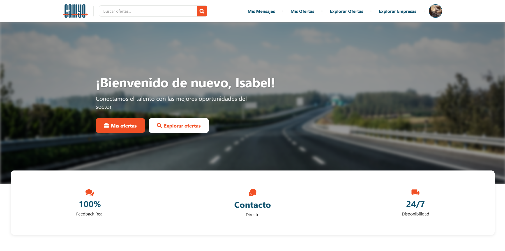

<h1 align="center">
  Camyo
</h1>

  

<h3 align="center">
  <strong>Grupo 5</strong>
</h3>

<h1 align="center">
  <strong>Revisión</strong>
</h1>

  <strong>Nombre del Entregable:</strong> Sprint 3

  <strong>Asignatura:</strong> Ingeniería del Software y Práctica Profesional  

  <strong>Curso:</strong> 2024-2025  

# Contribuciones del Equipo

| Nombre(s) y Apellido(s) | Tipo de Contribución |
| --- | --- |
| Raúl Heras Pérez | Mapas |
| José Ramón Baños Botón | Notificaciones y Borradores |
| Claudia Meana Iturri| Actualización general de imágenes y texto de varios apartados |
| Diego José Pérez Vargas | Pagos |

# Tabla de Contenidos

1. [Resumen Ejecutivo](#1-resumen-ejecutivo)
2. [Datos para la Revisión](#2-datos-para-la-revisión)
3. [Autenticación](#3-autenticación)  
   3.1 [Registro](#31-registro)  
   3.1.1 [Registro como camionero](#311-registro-como-camionero)  
   3.1.2 [Registro como empresa](#312-registro-como-empresa)  
   3.2 [Inicio de sesión](#32-inicio-de-sesión)  
4. [General](#4-general)  
   4.1 [Página de inicio](#41-página-de-inicio)  
   4.2 [Explorar y buscar ofertas](#42-explorar-y-buscar-ofertas)  
   4.3 [Detalle de oferta](#43-detalle-de-oferta)  
   4.4 [Listado de empresas](#44-listado-de-empresas)  
   4.5 [Detalle de empresa](#45-detalle-de-empresa)  
5. [Camionero](#5-camionero)  
   5.1 [Perfil de camionero](#51-perfil-de-camionero)  
   5.2 [Mis Ofertas](#52-mis-ofertas)  
   5.3 [Chat](#53-chat)  
6. [Empresas](#6-empresas)  
   6.1 [Perfil de empresa](#61-perfil-de-empresa)  
   6.2 [Crear Oferta](#62-crear-oferta)  
   6.3 [Suscripciones](#63-suscripciones)  
   6.4 [Promocionar Oferta](#64-promocionar-oferta)  
   6.5 [Chat](#65-chat)  
   6.6 [Mis Ofertas](#66-mis-ofertas)  
7. [Reseñas](#7-reseñas)  
   7.1 [Reseñas empresas](#71-reseñas-empresas)  
   7.2 [Reseñas camioneros](#72-reseñas-camioneros)  
   7.3 [Crear y editar reseñas](#73-crear-y-editar-reseñas)
8. [Pagos](#8-pagos)  
   8.1 [Finalizar compra](#81-finalizar-compra)  

## 1. Resumen Ejecutivo

Este documento proporciona una guía detallada para revisar la aplicación web de *matchmaking* de camioneros. Incluye un mapeo explícito de los casos de uso (UC) a las interacciones en el software, datos necesarios para la revisión, requisitos del sistema y un enlace a la demostración.

> **Nota:** es posible que ciertos aspectos visuales difieran de los mostrados en las capturas de este documento. Es importante recordar que este proyecto está en un proceso de mejora constante.

## 2. Datos para la Revisión

En esta tabla aparece toda la información necesaria para la revisión de Camyo.

| Información | Detalles |
| --- | --- |
| Url de la Organización de Github | https://github.com/Camyo-ISPP |
| Url del repositorio de Github | https://github.com/Camyo-ISPP/CamyoApp |
| Url del repositorio de Documentación | https://github.com/Camyo-ISPP/Documentacion |
| Url de la Landing Page | https://sites.google.com/view/camyo-landing-page/ |
| Url del despliegue Frontend | https://camyo-s3-9fe1b.web.app/ |
| Url de la herramienta de seguimiento  | https://app.clockify.me/login |
| Credenciales para la herramienta de seguimiento  | Email: [profesores.camyo@gmail.com](mailto:profesores.camyo@gmail.com) Contraseña de la cuenta de google: Profesores.camyo!01   Para acceder, hagan login con este email y recibirán un correo al correo con el código para acceder. |
| Requisitos potenciales para usar el sistema | Ninguno. |
| Url de la demo | https://www.youtube.com/watch?v=n2l7PjXaTwg |
| Usuario de Empresa (Camyo) | **Usuario:** emp_etsii1  **Contraseña:** etsiipass **Usuario:** emp_etsii2  **Contraseña:** etsiipass |
| Usuario de Camionero(Camyo) | **Usuario:** cam_etsii1  **Contraseña:** etsiipass **Usuario:** cam_etsii2  **Contraseña:** etsiipass (Autónomo) |
| Usuario Administrador  | **Usuario:** admin  **Contraseña:** etsiipass |
| Cuenta para Realizar los Pagos  | 4242 4242 4242 4242, cualquier fecha y cualquier CVV. |

## 3. Autenticación

### 3.1 Registro
Pantalla inicial del registro donde el usuario debe elegir si se registrará como Camionero o Empresa.

#### 3.1.1 Registro como camionero
Formulario detallado para el registro de camioneros, donde se solicitan datos personales, licencias, experiencia, CAP, y condición de autónomo. Cabe destacar la obligación de aceptar términos y condiciones.

#### 3.1.2 Registro como empresa
Formulario de registro para empresas, incluyendo información básica, datos de contacto, sitio web y número de identificación fiscal. Cabe destacar la obligación de aceptar términos y condiciones.

### 3.2 Inicio de sesión
Formulario para que usuarios registrados ingresen con su nombre de usuario y contraseña. Incluye opción para redirigirse al registro si aún no tienen cuenta.

## 4. General

### 4.1 Página de inicio

**Visitante:**

Pantalla principal para usuarios no autenticados, destacando el objetivo de la plataforma y mostrando ofertas recientes disponibles para explorar sin necesidad de iniciar sesión.

**Usuario registrado:**

Pantalla de bienvenida personalizada para usuarios registrados, con accesos rápidos al perfil y a vacantes, además de una lista de ofertas recientes divididas por tipo: carga y trabajo.

### 4.2 Explorar y buscar ofertas

Vista general del buscador de ofertas donde los usuarios pueden explorar las ofertas publicadas.

La pantalla tiene una seccion de búsqueda que permite filtrar ofertas según los requisitos del usuario, mostrando resultados relevantes en tiempo real.

### 4.3 Detalle de oferta
Vista del detalle de una oferta visible para visitantes, que muestra los datos pero requiere iniciar sesión para poder solicitarla.

Pantalla de detalle de una oferta para usuarios autenticados, con botón activo para solicitarla y toda la información relevante del transporte: presupuesto, licencias, origen/destino, fechas y carga. Para las ofertas de carga se incluye un mapa con la ruta entre origen y destino.

Si solicitamos la oferta nos saldrá un mensaje si la solicitud se ha completado.

En el caso de estar iniciado sesión como empresa, y entramos en detalle de oferta en una oferta propia. Veríamos las camioneros que han solicitado la oferta:

Los camioneros que han aplicado a la oferta y la empresa que ha hecho la oferta ha rechazado:

Y la opción de eliminar la oferta:

### 4.4 Listado de empresas
Pantalla que muestra un listado de empresas registradas en la plataforma con información básica como nombre, web, identificación, ubicación y teléfono, además de acceso a sus perfiles detallados. Se accede mediante el botón de menú sobre empresa.

### 4.5 Detalle de empresa
Vista del perfil de una empresa con su información de contacto, descripción, sitio web, ofertas activas y opción para contactar o dejar una reseña. Se ve las ofertas patrocinadas de la empresa en las ofertas activas. También se muestra una sección para valoraciones de otros usuarios.

## 5. Camionero

### 5.1 Perfil de camionero

Vista privada del perfil del camionero, donde puede ver su información profesional y reseñas recibidas. Además puede editar los datos de su perfil haciendo click sobre la imagen de perfil en la parte superior derecha de la pantalla, y después en ver perfil. Dentro de tu perfil podrás editar el perfil haciendo click sobre el lapiz al lado de la foto de perfil y si quisiera eliminar su cuenta se hace abajo en eliminar cuenta

En la edición de perfil el usuario podrá editar:

Perfil público visible para las empresas, donde se muestra información laboral, contacto y reseñas recibidas.

### 5.2 Mis Ofertas

Una vez iniciada la sesión como camionero, aparece en la barra de navegación la sección "Mis Ofertas" que muestra las solicitudes que ha realizado el camionero y se pueden filtrar por ofertas pendientes (en espera de respuesta por parte de la empresa), asignadas (ofertas aceptadas por la empresa) o descartadas (ofertas en las que el camionero no fue seleccionado para el trabajo o carga).

### 5.3 Chat
Una vez iniciado sesión como transportista se podrá acceder a la pantalla de mensajería mediante la barra de navegación, en el apartado de "Mis Mensajes".

En la pantalla de chats se podrán ver los chats abiertos. Una vez que se seleccione el chat, se abrirá automáticamente a la derecha de la lista, por lo que se podrá comenzar a enviar y recibir mensajes.

La pantalla también cuenta con un buscador que filtra por el nombre del usuario con el que se quiera contactar. Solo aparecerán aquellos usuarios con los que tenga un chat abierto previamente.

En la pantalla de chat se podrá visualizar las notificaciones para saber si tienes alguna pendiente. 

## 6. Empresas

### 6.1 Perfil de empresa

Vista privada del perfil de empresa, con acceso para editar información, publicar nuevas ofertas y gestionar el plan de suscripción. Muestra también las ofertas activas y las reseñas recibidas.

Perfil público de empresa donde se pueden consultar los datos de contacto, descripción, web, ofertas abiertas y reseñas de la empresa.

### 6.2 Crear Oferta

Al acceder a la plataforma como empresa, podrás crear ofertas para camioneros desde tu perfil. Para hacerlo, debes rellenar los campos requeridos según el tipo de oferta que quieras publicar, ya sea de carga o de trabajo. Tras publicarla, esta oferta será visible para el resto de usuarios.

Además, hay un botón para poder guardar borradores de las ofertas. 

En la pantalla de "Mis Ofertas" en "Borradores" podremos ver los borradores que se han creado.

Además está la posibilidad de editar estos borradores, eliminarlos o publicarlos

Sin embargo, el número de ofertas activas que puedes tener simultáneamente depende del nivel de tu suscripción actual:

- **Suscripción Gratis**: Puedes tener hasta **1 oferta activa**. **No** se pueden promocionar ofertas.
- **Suscripción Básica**: Puedes tener hasta **3 ofertas activas**. Se puede **promocionar 1 oferta**.
- **Suscripción Premium**: No hay límite en el número de ofertas activas. No hay límite de promoción de ofertas.

### 6.3 Suscripciones

En la pantalla de perfil de empresa, verás un botón para crear una nueva oferta. Este botón cambiará su estado según las siguientes condiciones:

- Si aún no has alcanzado el límite de ofertas permitidas por tu suscripción:
  - El botón estará habilitado y podrás crear una nueva oferta.

- Si has alcanzado el límite de ofertas activas permitidas:
  - El botón se bloqueará y mostrará el mensaje **"Límite de Ofertas Alcanzado"**.

Pantalla donde las empresas pueden elegir entre tres planes: Gratis, Básico y Premium, con distintas capacidades para publicar ofertas de empleo según el nivel de suscripción.

/images/suscripciones.png)

### 6.4 Promocionar Oferta

En el perfil de oferta se podrán ver las ofertas abiertas de las empresas, y en función del plan elegido se pondrá en disposición la posibilidad de promocionar una o varias ofertas.

### 6.5 Chat
Una vez iniciado sesión como empresa se podrá acceder a la pantalla de mensajería mediante la barra de navegación, en el apartado de "Mis Mensajes". Tienen las mismas características que el panel de mensajes de camioneros (véase [5.3 Chat](#53-chat)).

### 6.6 Mis Ofertas
Listado de ofertas de trabajo o carga creadas por la empresa que han sido asignadas (abiertas) o no (cerrradas) a algún camionero.

/images/misofertasemp1.png)
/images/misofertasemp2.png)

## 7. Reseñas
### 7.1 Crear y ver reseñas 
Tanto para camionero como para perfil se les permitirá valorar a las empresas o camioneros recientes y ver los comentarios que han sido dejados por la empresas o camioneros con los q se ha trabajado recientemente.

También pueden ver las reseñas de un usuario y su valoración media. En este caso de un camionero.

### 7.3 Editar y Borrar reseñas
Cuando un usuario visite un perfil público en el que ha dejado una reseña podrá editar y borrar su reseña

## 8. Pagos

### 8.1 Finalizar compra

Para acceder a la página para finalizar la compra, primero se deberá interactuar con un botón que lleve a ella. Este puede ser:

- El botón **Cambiar a este plan** en uno de los planes de suscripción (véase [6.3 Suscripciones](#63-suscripciones))
- El botón **Patrocinar** en los listados de oferta para empresas (véase [6.4 Promocionar Oferta](#64-promocionar-oferta) o [6.6 Mis Ofertas](#66-mis-ofertas))

Una vez se haya pulsado uno de estos botones, el usuario será redirigido a la siguiente página:

En ella, se muestra un resumen de la compra, con el precio de la misma. El pago comienza cuando se interactúa con el botón **Continuar al pago**. A partir de aquí, se podrá introducir la información de pago.

El pago se realiza cuando se pulsa **Confirmar pago**. Si el pago se realiza correctamente, se mostrará un mensaje de éxito y se redirigirá al usuario a la página principal. De lo contrario, se mostrará un error debajo del botón **Confirmar pago** y en alguno de los campos de información de pago, si el problema proviene de ahí.

La compra se puede cancelar pulsando la flecha a la izquierda del título **Finalizar compra**. El usuario volverá a la página en la que estaba antes.

Nota: si se intenta acceder a la página de finalización de compra de otra forma que no sea las indicadas anteriormente, se mostrará un error. Esto se debe a que la interacción con los botones, además de redirigir al pago, le pasan a esta página el tipo de compra y, en caso de ser el patrocinio de una oferta, su ID.

