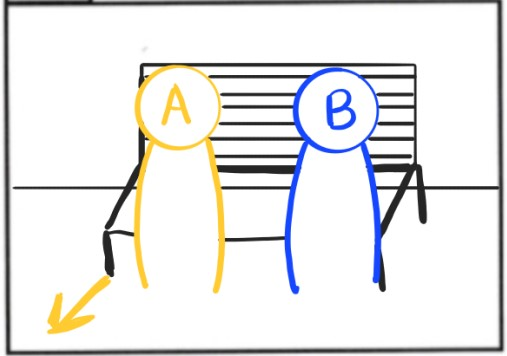
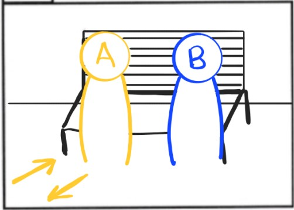
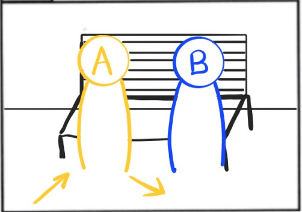
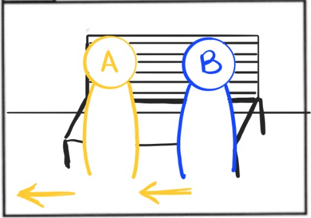
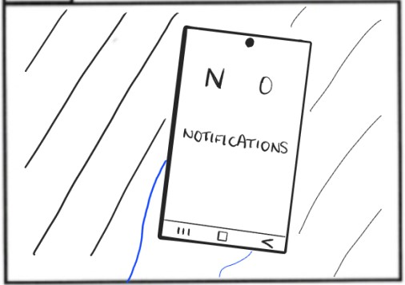

<h1 align="center">
  Camyo
</h1>

  

<h3 align="center">
  <strong>Grupo 5</strong>
</h3>

<h1 align="center">
  <strong>Storyboard</strong>
</h1>

  <strong>Nombre del Entregable:</strong> Sprint 3 

  <strong>Asignatura:</strong> Ingeniería del Software y Práctica Profesional  

  <strong>Curso:</strong> 2024-2025  

### Contribuciones del Equipo

| Nombre(s) y Apellido(s)       | Tipo de Contribución          |
|-------------------------------|-------------------------------|
| Sonia María Rus Morales       | Redacción del documento       |

## Tabla de Contenidos

1. [Introducción](#introducción)
2. [Storyboard para transportistas](#storyboard-para-transportistas)

## Introducción

Este documento presenta el Storyboard para la aplicación Camyo centrado en la visión para los transportistas.

## Storyboard para transportistas

**Objetivo:** Mostrar de forma visual y narrativa cómo la aplicación Camyo soluciona un problema real en el sector del transporte. Captar de manera clara cómo Camyo simplifica la contratación de camioneros, ofreciendo una solución práctica y moderna.

**Escena 1**

- **Acción:** Hay dos personas sentadas en un banco. La persona A recibe una llamada y se va dejando la escena por la parte izquierda.

- **Sonido:** Teléfono móvil, ruido ambiente.
- **Observaciones técnicas:** -

**Escena 2**

- **Acción:** La personas A vuelve a escena, se sienta en el banco, le vuelve a sonar el teléfono y deja la escena por donde ha venido.  

- **Sonido:** Teléfono móvil, ruido ambiente.  
- **Observaciones técnicas:** -

**Escena 3**

- **Acción:** La persona A entra en escena otra vez, antes de sentarse en el banco responde a una nueva llamada y abandona la escena por la derecha. 

- **Sonido:** Teléfono móvil, ruido ambiente.  
- **Observaciones técnicas:** B cambia de postura en el banco.

**Escena 4**

- **Acción:** A vuelva a entrar en escena respondiendo una llamada y continúa su camino hasta volver a salir de escena. 

- **Sonido:** Teléfono móvil, ruido ambiente.  
- **Observaciones técnicas:**  

**Escena 5**

- **Acción:** La persona B mira su teléfono móvil.

- **Sonido:**  Sonido ambiente. 
- **Observaciones técnicas:** -