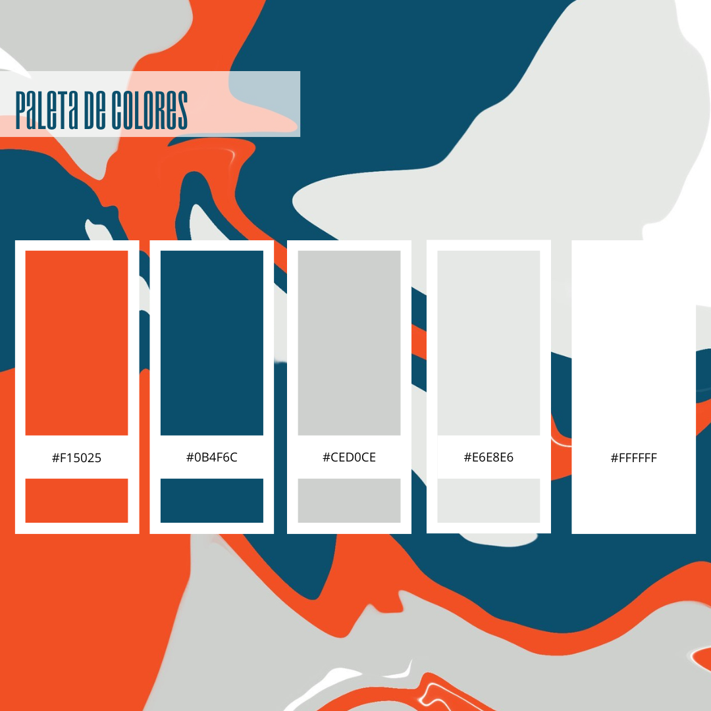

<h1 align="center">
  Camyo
</h1>

  

<h3 align="center">
  <strong>Grupo 5</strong>
</h3>

<h1 align="center">
  <strong>Paleta de Colores</strong>
</h1>

  <strong>Nombre del Entregable:</strong> [Preparing Project Launch(PPL)]  

  <strong>Asignatura:</strong> Ingeniería del Software y Práctica Profesional  

  <strong>Curso:</strong> 2024-2025  

### Contribuciones del Equipo

| Nombre(s) y Apellido(s)       | Tipo de Contribución          |
|-------------------------------|-------------------------------|
| Lucía Pérez Gutiérrez             | Creación        |

## Tabla de Contenidos

1. [Paleta de colores](#paleta-de-colores--camyo)

## 1. Paleta de Colores – Camyo

| Nombre del Color       | HEX       | RGB              | HSL               |
|------------------------|-----------|------------------|-------------------|
| **Naranja Camyo**      | `#f15025` | (241, 80, 37)     | 13, 85%, 55%      |
| **Azul Camyo**         | `#0b4f6c` | (11, 79, 108)     | 198, 90%, 23%     |
| **Blanco Camyo**       | `#ffffff` | (255, 255, 255)   | 0, 0%, 100%       |
| **Gris Claro Camyo**   | `#e6e8e6` | (230, 232, 230)   | 120, 1%, 91%      |
| **Gris Medio Camyo**   | `#ced0ce` | (206, 208, 206)   | 120, 1%, 81%      | 

