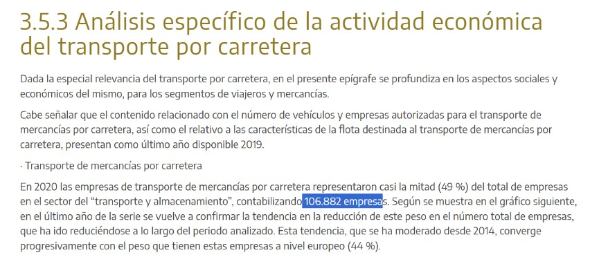
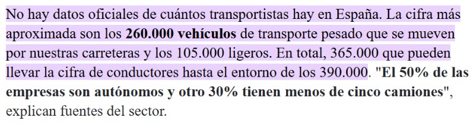
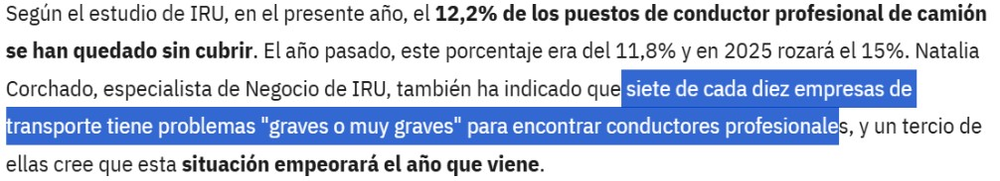
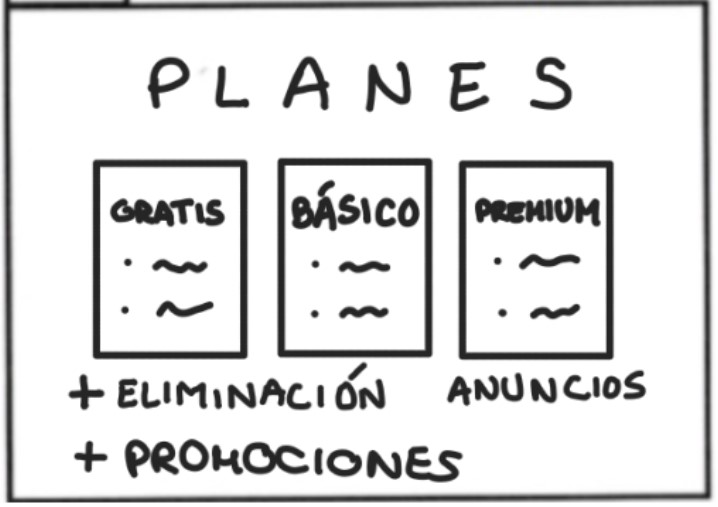

<h1 align="center">
  Camyo
</h1>

  

<h3 align="center">
  <strong>Grupo 5</strong>
</h3>

<h1 align="center">
  <strong>Storyboard</strong>
</h1>

  <strong>Nombre del Entregable:</strong> PPL 

  <strong>Asignatura:</strong> Ingeniería del Software y Práctica Profesional  

  <strong>Curso:</strong> 2024-2025  

### Contribuciones del Equipo

| Nombre(s) y Apellido(s)       | Tipo de Contribución          |
|-------------------------------|-------------------------------|
| Sonia María Rus Morales       | Redacción del documento       |

## Tabla de Contenidos

1. [Introducción](#introducción)
2. [Storyboard para inversores](#storyboard-para-inversores)

## Introducción

Este documento presenta el Storyboard para la aplicación Camyo centrado en la visión para los inversores.

## Storyboard para inversores

**Objetivo:** Mostrar de forma visual y narrativa cómo la aplicación Camyo se posiciona como una oportunidad de inversión rentable y escalable para los inversores..

**Escena 1**

- **Acción:** Se deslizan las noticias hacia arriba.

- **Sonido:** Según el reporte del transporte del gobierno de España, sabemos que hay aproximadamente 100k empresas de transportes, 365K vehículos de transporte y unos 400k transportistas.  
- **Observaciones técnicas:** Noticia empresas: [3.5.3 Análisis específico de la actividad económica del transporte por carretera | OTLE ](https://otle.transportes.gob.es/inform/es/2022/3competitividad/35estructura-de-mercado-y-empresarial/353analisis-especifico-de-la-actividad-economica-del-transportepor-carretera#:~:text=En%202020%20las%20empresas%20de,almacenamiento%E2%80%9D%2C%20contabilizando%20106.882%20empresas)

Noticia camioneros: [Radiografía del camionero español: 50 años y autónomos ahogados por el gasoil](https://www.elindependiente.com/economia/2022/03/26/radiografia-del-camionero-espanol-50-anos-y-autonomos-ahogados-por-el-gasoil/)

Las fotos de las noticias aparecen según se digan. 

**Escena 2**

- **Acción:** - 

- **Sonido:** 7 de cada 10 de estas empresas tienen dificultades para encontrar transportistas profesionales y un tercio de ellas piensan que esta situación empeorará en el futuro.

- **Observaciones técnicas:** Noticia dificultades empresa: https://www.rutadeltransporte.com/noticias-transporte/camioneros-camion-satisfechos-trabajo-no_0_2000006375.html 

**Escena 3**

- **Acción:** - 

- **Sonido:** Por otro lado, los camioneros siguen fiándose del boca a boca para engancharse a una ruta: si nadie corre la voz, el camión se queda parado. En 2024 quedaron más de 3 000 plazas sin cubrir porque muchas ofertas jamás llegaron a sus oídos.  
- **Observaciones técnicas:** https://www.rutadeltransporte.com/noticias-transporte/el-2024-termino-con-mas-de-3000-puestos-de-conductor-de-camion-vacantes-en-infojobs.html?utm_source=chatgpt.com 

**Escena 4**

- **Acción:** Aparece el logo de la aplicación.

- **Sonido:** Por eso os presentamos “CAMYO”, una aplicación revolucionaria para este sector. Con CAMYO las empresas publicarán sus ofertas y los transportistas las solicitarán en cuestión de segundos. 
- **Observaciones técnicas:**  -

**Escena 5**

- **Acción:** -

- **Sonido:**  Hemos diseñado planes con los que nuestros usuarios podrán publicar más y obtener mayor visibilidad, complementados con opciones como la promoción de ofertas o la eliminación de anuncios, con los que prevemos resultados sólidos que impulsan tanto su crecimiento… como el nuestro. 
- **Observaciones técnicas:** -

**Escena 6**

- **Acción:** Aparecen los datos de 1% y de los 27 meses. 

- **Sonido:**  Estimamos que el 1 % del sector se incorpore a CAMYO, unas mil empresas y cuatro mil transportistas, cifra que nos llevará a la rentabilidad en solo veintisiete meses. 
- **Observaciones técnicas:** -

**Escena 7**

- **Acción:** -

- **Sonido:**  Con ello, ofrecemos tres paquetes de inversión: Essential, Elite y Visionary. Pensados para todo tipo de perfiles de inversores, desde quienes buscan una entrada accesible hasta aquellos con visión estratégica a largo plazo. Optando por una primera entrada accesible al proyecto con el paquete Essential. Con una inversión de 5.000€, se poseería un 1,88% de la empresa y un retorno de unos 150€ al mes a partir de los 34 meses.

- **Observaciones técnicas:** Diferenciar bien de los planes de precios de la aplicación.

**Escena 8**

- **Acción:** -

- **Sonido:**  Con tu ayuda podremos financiar las campañas de marketing, la captación de usuarios y las mejoras tecnológicas, impulsando así el futuro de nuestra aplicación. 
- **Observaciones técnicas:** -

**Escena 9**

- **Acción:** Aparece el logo de la empresa y el correo electrónico.

- **Sonido:**  Así que no esperes más, únete a CAMYO y forma parte de la revolución del transporte. CAMYO, “Donde los camioneros y las empresas se encuentran”. 
- **Observaciones técnicas:** -