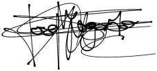
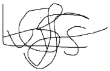

<h1 align="center">
  Camyo
</h1>

  

<h3 align="center">
  <strong>Grupo 5</strong>
</h3>

<h1 align="center">
  <strong>Acuerdo de Compromiso con Usuarios Piloto</strong>
</h1>

  <strong>Nombre del Entregable:</strong> Sprint 1 

  <strong>Asignatura:</strong> Ingeniería del Software y Práctica Profesional  

  <strong>Curso:</strong> 2024-2025  

### Miembros del Grupo

| Nombre(s) y Apellido(s) | Tipo de Contribución               |
| ----------------------- | ----------------------------------- |
| Carlos García Ortiz    | Elaboración del documento completo |

## Tabla de Contenidos

1. [Resumen general](#Resumen-General)
2. [Compromiso de Camyo](#Compromiso-de-Camyo)
3. [Compromiso de los Usuarios Piloto](#Compromiso-de-los-Usuarios-Piloto)
4. [Duración del Compromiso](#Duración-del-Compromiso)
5. [Cambios en el Compromiso](#Cambios-en-el-Compromiso)
6. [Firmas](#Firmas)
   1. [Firmas por Camyo](#Firmas-por-Camyo)
   2. [Firmas por Usuarios Piloto](#Firmas-por-Usuarios-Piloto)

## **Resumen General**

El presente acuerdo establece los términos y condiciones para la participación en el programa de usuarios piloto, mediante este compromiso tanto Camyo como los usuarios piloto tomarán responsabilidad durante los meses del desarrollo del proyecto.

## Compromiso de Camyo

- Camyo se compromete a entregar una versión del producto para ser probada por los usuarios pilotos para al menos la fecha de finalización de cada sprint.
- La versión entregada contendrá todas las características y funcionalidades acordadas para el sprint en cuestión, sin perjuicio de posibles cambios de última hora debidamente comunicados y justificados. Además se entregará una encuesta que los usuarios deberán rellenar para informar de cualquier opinión, valoración, sugerencias de mejora o error con el uso del servicio.

* Una vez terminado el proyecto, Camyo se compromete a mantener la confidencialidad de los usuarios piloto, eliminando cualquier tipo de dato que se haya guardado durante la realización del mismo sobre los usuarios piloto.

## Compromiso de los Usuarios Piloto

* Los usuarios piloto se comprometen a probar las versiones proporcionadas por Camyo dentro de los plazos establecidos de una semana y a proporcionar feedback detallado y constructivo sobre su experiencia y cualquier problema encontrado durante la prueba.
* Los usuarios piloto se comprometen a respetar la confidencialidad de las versiones proporcionadas y a no divulgar información sensible o confidencial a terceros.

## Duración del Compromiso

Este acuerdo de usuarios piloto tendrá validez hasta la fecha final del proyecto y se considerará válido desde la fecha de firma por ambas partes.

## Cambios en el Compromiso

En el caso de que se considerara necesario realizar un cambio significativo en el compromiso, se comunicaría a los usuarios piloto con antelación y si ambas partes llegasen a un acuerdo, se modificaría este documento y sería requerida su firma nuevamente.

## Firmas

Al firmar este documento, entiendo y acepto las responsabilidades que se me han asignado y me comprometo a cumplirlas según lo establecido en este compromiso. Para aquellos usuarios piloto seleccionados mediante encuestas, la aceptación a ser usuarios piloto en dicho formulario declarará la participación en este compromiso y no requerirá la firma.

### Firmas por Camyo

Project Manager - Adriana Vento Conesa - 10/03/2025

Líder de Gestión de Usuarios Piloto - Carlos García Ortiz - 10/03/2025

### Firmas por Usuarios Piloto

Estudiante G9 - Isaac Solis Padilla - 11/03/2025

Estudiante G8 - Jose Maria Morgado Prudencio - 10/03/2025

Estudiante G9 - Juan García Carballo - 11/03/2025

Estudiante G8 - Luis Giraldo Santiago - 10/03/2025

Estudiante G7 - Manuel Velez López - 10/03/2025

Estudiante G11 - Yesica Leydi Garate Fuentes - 10/03/2025

